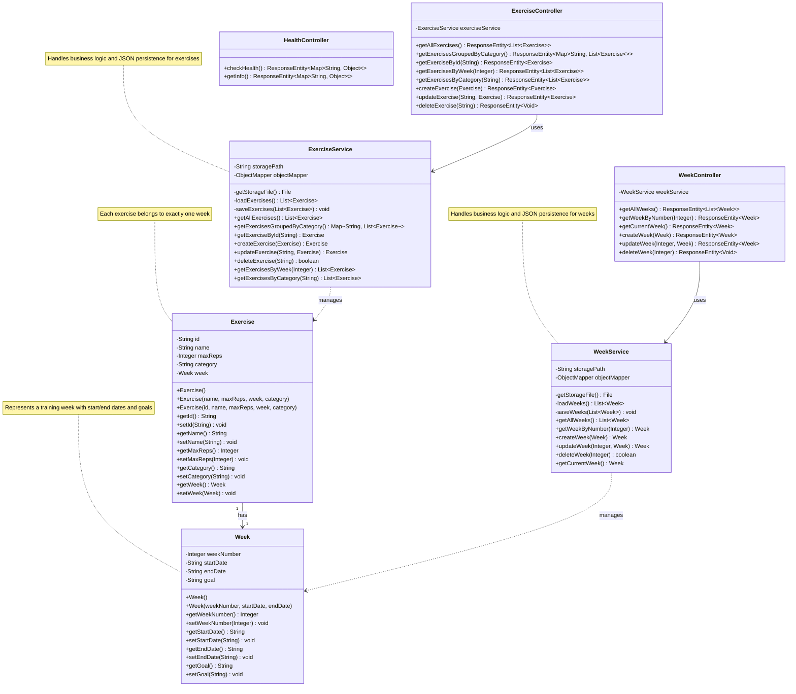

# GYMBot Backend Class Diagram

## Class Relationships

### Associations
- **Exercise → Week**: Each Exercise has exactly one Week (composition relationship)
  - Currently implemented as `weekNumber` (Integer)
  - Will be refactored to a Week object reference

### Dependencies
- **ExerciseController → ExerciseService**: Controller depends on service for business logic
- **WeekController → WeekService**: Controller depends on service for business logic
- **ExerciseService → Exercise**: Service manages Exercise entities
- **WeekService → Week**: Service manages Week entities

## Key Design Patterns

### MVC Pattern
- **Model**: Exercise, Week
- **Service**: ExerciseService, WeekService (Business Logic Layer)
- **Controller**: ExerciseController, WeekController, HealthController (Presentation Layer)

### Repository Pattern (JSON-based)
- Both services implement file-based storage using Jackson ObjectMapper
- Storage location configured via `data.storage.path` property

### RESTful API Design
- Controllers expose REST endpoints using Spring annotations
- Standard HTTP methods: GET, POST, PUT, DELETE
- ResponseEntity for flexible HTTP responses

## Future Enhancements

### Planned Classes
- **User**: User authentication and profile management
- **Workout**: Collection of exercises for a specific day
- **ChatbotService**: AI-powered workout suggestions
- **StatisticsService**: Analytics and progress tracking

### Database Migration
- Current: JSON file-based storage
- Future: Consider JPA/Hibernate with relational database (PostgreSQL/MySQL)
- Will require Repository interfaces and Entity annotations
